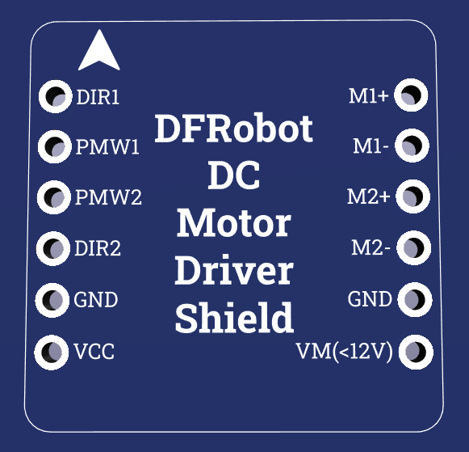

# DFRobot DC Motor Driver Shield

This is a KiCad library representing the
[DFRobot micro dual way DC motor driver](https://wiki.dfrobot.com/2x1.2A_DC_Motor_Driver__TB6612FNG__SKU__DRI0044),
as a shield.

## Images

Here is what the footprint looks like in KiCad:

### Footprint

### Silkscreen

### 3D Model

## Setup

To get the library working, you need to add path of this repository to the KiCad
library search path. This can be done by going to
`Preferences -> Configure Paths` and adding the path with the name
`DFRobot_DC_Motor_Driver_Shield`.
